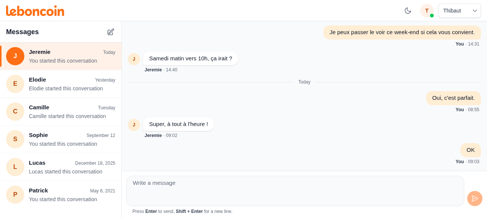
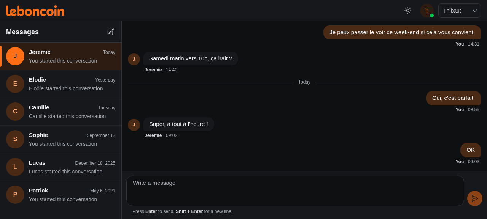
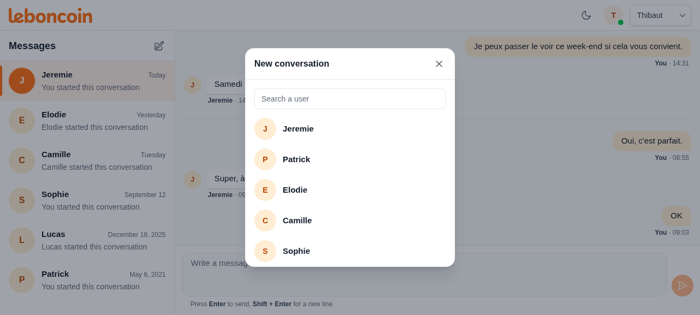
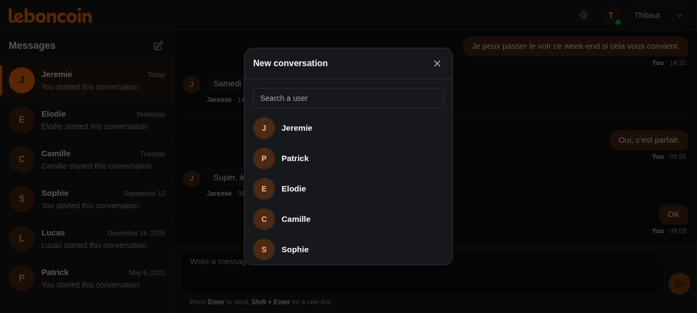
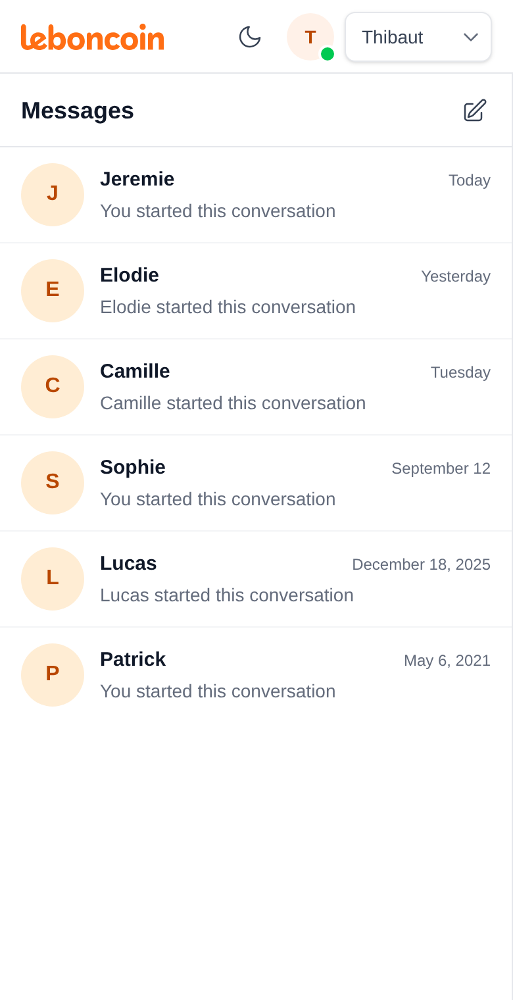
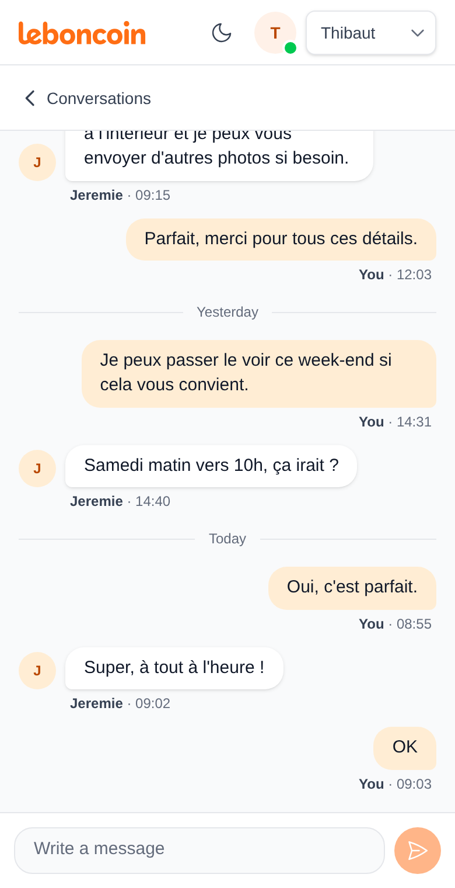
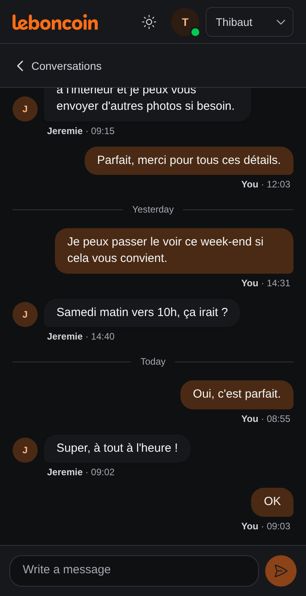
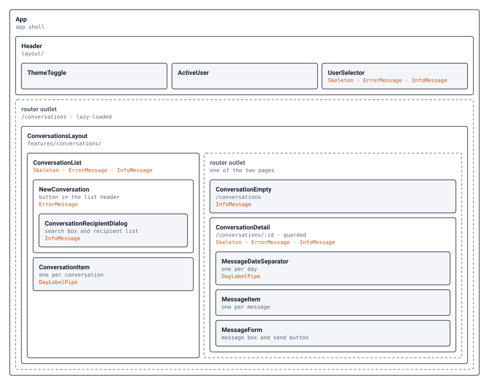
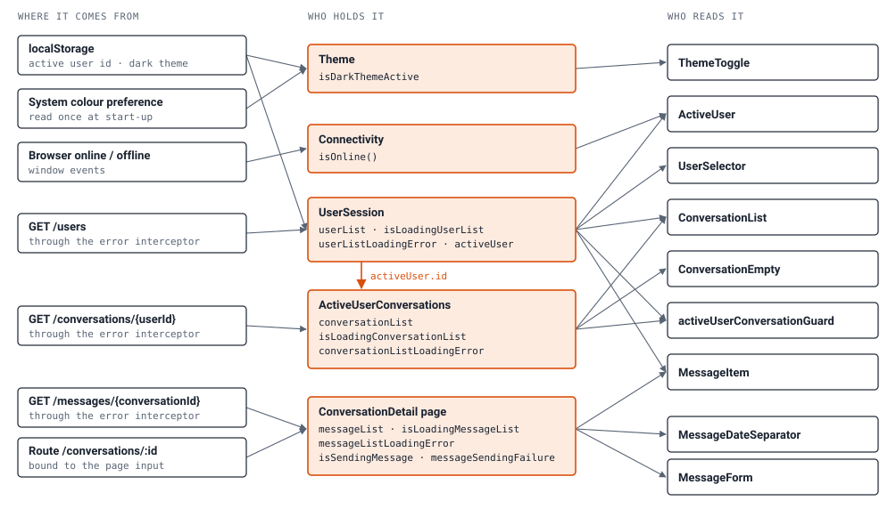

# leboncoin messaging app

A messaging app for leboncoin users: read your conversations and reply about a transaction or a product, on desktop and on phone. Built with Angular 22 and Tailwind CSS 4.

This project is my implementation of the [leboncoin frontend technical test](https://github.com/leboncoin/frontend-technical-test). Below: what I built, the decisions behind it and how the code is organised.

The look follows leboncoin's own website: its orange, its logo, rounded shapes and an avatar with each contact's initial. The layout is responsive. On desktop the conversation list and the open conversation sit side by side; on a phone they are two screens, with a link back to the list.

<table>
  <tr>
    <th width="50%">Desktop, light theme</th>
    <th width="50%">Desktop, dark theme</th>
  </tr>
  <tr>
    <td></td>
    <td></td>
  </tr>
  <tr>
    <th>Desktop, new conversation dialog</th>
    <th>Desktop, new conversation dialog (dark theme)</th>
  </tr>
  <tr>
    <td></td>
    <td></td>
  </tr>
</table>

<table>
  <tr>
    <th width="33%">Phone, conversation list</th>
    <th width="33%">Phone, open conversation</th>
    <th width="33%">Phone, open conversation (dark theme)</th>
  </tr>
  <tr>
    <td></td>
    <td></td>
    <td></td>
  </tr>
</table>

## Run it

Node 22 is required. The mock API runs on `json-server`, which is not a dependency of the project and must be installed globally. Use a 0.x version: the 1.x versions no longer accept the `--routes` and `--middlewares` options the start script relies on.

```bash
npm install -g json-server@0.16.3
npm install
npm run start-server   # mock API on http://localhost:3005, in a first terminal
npm run start-app      # app on http://localhost:4200, in a second terminal
```

Then open http://localhost:4200. On a first visit the app starts as the first user of the list; the selector in the header switches to another one.

- `npm run test`: unit tests once, with coverage. The run fails under 100% on statements, branches, functions and lines.
- `npm run build`: production build.

A pre-commit hook formats the staged files with Prettier, then runs the tests.

### Trying a slow or failing server

The mock API can delay its answers. Pass the delay in milliseconds when starting it:

```bash
npm run start-server -- --delay 3000
```

- Under 10 seconds (for example `3000`), the skeletons and "Sending…" stay on screen for that long.
- Above 10 seconds (for example `12000`), the app's timeout is reached first: "The service is temporarily unavailable" is shown with "Try again".
- With the server stopped, "Can't reach the server" is shown with "Try again".

The delay applies to users and messages. The conversation list is served by the provided middleware, which answers before the delay is applied.

## What is built

| Asked                                       | How it works                                                                  |
| ------------------------------------------- | ----------------------------------------------------------------------------- |
| List all conversations                      | Conversations of the active user, most recent first                           |
| Select a conversation and read its messages | Messages grouped by day, with author and time                                 |
| Type and send a message                     | Message box at the bottom of the open conversation                            |
| Desktop and mobile                          | Two panes on desktop; list, then conversation, on phone                       |
| Robust safety guards                        | See [Safety guards](#safety-guards)                                           |
| Bonus 1: create a conversation              | "New conversation" button, with a searchable list of users                    |
| Bonus 2: handle server crashes gracefully   | Every failed or unanswered request shows a clear error and "Try again"        |
| Accessibility                               | Lighthouse accessibility score of 100 on the list and on an open conversation |
| Tests                                       | 140 unit tests, 100% coverage                                                 |

Added on top: a user selector in the header (the API has no login, so this is how you become one of the users), a light and dark theme, and loading skeletons that mirror the final layout.

## Design decisions

### Where state lives

I put state in a service only when more than one part of the app reads it. Users and conversations are in that case, so each has its state service: `UserSession` and `ActiveUserConversations`. Messages are different. Only the conversation page reads them, and they depend on that page's route id, so the page holds them itself. That makes the page the one exception in the state graph further down. A service for messages would look more symmetrical, but I preferred not to add a layer with a single consumer.

### Reloading

State is built on Angular's `resource`, with a signal as its parameter. When the active user changes, the conversations reload; when the route id changes, the messages reload. No component has to trigger it.

### Errors

An HTTP interceptor turns every failed request into an `AppError` with a kind: `network`, `not-found`, `server`, `unauthorized`, `unavailable` or `unknown`. Components pick an error text and an icon from that kind. None of them reads a status code.

The test brief says the servers are shaky. A crashed server fails the request at once, but one that never answers would leave the screen on its skeleton, so every request is cut after 10 seconds and shown as `unavailable`, with "Try again".

### Access to a conversation

Only a participant can open a conversation. That rule is written once, in a route guard, and the page trusts it rather than checking again.

### Shared components

`Skeleton`, `ErrorMessage`, `InfoMessage` and the day label pipe know nothing about users or conversations; they only take inputs. That is why the user selector, the conversation list and the message list behave the same way when loading, failing or empty.

### Creating a conversation

The "New conversation" button is shown only after the conversation list has loaded, so the app knows who the active user is already talking to. Choosing a recipient then opens the existing conversation with them, or creates it if there is none.

### Switching conversation while a message is sending

A message keeps sending when another conversation is opened before the server answers. The request is never cancelled; only its result is ignored when it no longer concerns the open conversation, so neither the message nor a sending error shows up in the wrong place. The message is still stored, and appears when the user comes back to that conversation.

### Colours and themes

Templates use colour tokens named by role, such as `surface`, `content` and `line`. The dark theme redefines the tokens in one place, so no template has a dark variant. On a first visit, with no theme saved yet, the app starts in the light or dark theme of the system preference. As soon as the user toggles the theme, that choice is saved in `localStorage` and is the one applied on the next visits. The active user is saved the same way.

### What I left out

- Deleting a conversation or a message. The mock server answers `404` to every delete (observation 8 below), and the exercise does not ask for it.
- Sending the user's token. The documentation never says how (observation 1 below).

## Safety guards

The test brief asks for robust safety guards. This is what protects the user today:

- In the app, a route guard redirects anyone who is not a participant of the requested conversation, including after a page reload or a change of user. This is not access control (observation 2 below).
- Any request can fail, or stay unanswered for more than 10 seconds, without breaking the screen: the user sees what happened and can try again.
- The send button is disabled for an empty message, while a message is being sent, while a failed message is waiting for its retry, and while the messages are loading or failed to load.
- A message is limited to 1000 characters. The message box stops there, and the length is checked again before sending, in case the limit was removed from the page. The API documents no limit, so this one is a choice made in the app.
- A message or an error that comes back after another conversation was opened is not shown there.

## How the code is organised

```
src/app/
  core/       no UI, used by the whole app: users, errors, connectivity, theme, config
  shared/     presentational components, pipes and utils driven by inputs and outputs
  layout/     the header and what is always on screen
  features/
    conversations/   lazy-loaded: layout, pages, components, services, models, guards, utils
```

- `core` imports nothing from the other folders. `shared` may only import models from `core`. `layout` and `features` never import each other.
- Inside a domain, files are grouped by type, then one folder per file with its template, stylesheet and spec: `features/conversations/services/active-user-conversations/active-user-conversations.ts`.

Each data domain is made of the same four pieces, with the same member names (`…List`, `isLoading…List`, `…ListLoadingError`, `reload…List()`):

| Piece                                      | Users          | Conversations             | Messages                              |
| ------------------------------------------ | -------------- | ------------------------- | ------------------------------------- |
| Model, as the API returns it               | `User`         | `Conversation`            | `Message`                             |
| API service, one method per endpoint       | `Users`        | `Conversations`           | `Messages`                            |
| State, as signals built on a `resource`    | `UserSession`  | `ActiveUserConversations` | held by the `ConversationDetail` page |
| Component that chooses which state to show | `UserSelector` | `ConversationList`        | `ConversationDetail`                  |

## Where to start reading

Six files give the whole picture, in this order:

1. [`user-session.ts`](src/app/core/users/services/user-session/user-session.ts): the smallest state service. The other state follows the same shape.
2. [`http-error.ts`](src/app/core/errors/interceptors/http-error/http-error.ts): the interceptor that turns every failed request into an `AppError`.
3. [`active-user-conversations.ts`](src/app/features/conversations/services/active-user-conversations/active-user-conversations.ts): the same shape as the first file, reloading when the active user changes, plus conversation creation.
4. [`conversation-list.html`](src/app/features/conversations/components/conversation-list/conversation-list.html): the template that reads that state and shows the list of active user conversations.
5. [`active-user-conversation.ts`](src/app/features/conversations/guards/active-user-conversation/active-user-conversation.ts): the guard that decides who may open a conversation.
6. [`conversation-detail.ts`](src/app/features/conversations/pages/conversation-detail/conversation-detail.ts): the page that loads the messages and sends new ones.

The git history has one commit per step, from the layout to message sending. `git log --reverse` reads in the order the app was built.

## Components on screen

Each box is drawn inside the component whose template contains it. Dashed boxes are router outlets, which show one page at a time. Orange text names what a component uses from `shared`.



## State: where it comes from, who holds it, who reads it

Components keep no data of their own. They read signals from a small number of holders and send them commands.



Four holders are services: they live for the whole app and do not depend on a page. The fifth is the `ConversationDetail` page (see [Where state lives](#where-state-lives)). The `Users`, `Conversations` and `Messages` API services keep no data: they only make the requests.

Data only flows left to right. The orange arrow is the one dependency between holders: when the active user changes, the conversations reload for that user. The same happens one level down when the route id changes: the page reloads its messages.

What goes back are a few commands:

| From                 | Command                                                         | Effect                                                                                  |
| -------------------- | --------------------------------------------------------------- | --------------------------------------------------------------------------------------- |
| `ThemeToggle`        | `Theme.toggleTheme()`                                           | Switches theme with a fade and saves the choice                                         |
| `UserSelector`       | `UserSession.setActiveUser(id)`                                 | Changes and saves the active user, then asks the router to check the current page again |
| `UserSelector`       | `UserSession.reloadUserList()`                                  | "Try again" after the users request failed                                              |
| `ConversationList`   | `ActiveUserConversations.reloadConversationList()`              | "Try again" after the conversations request failed                                      |
| `NewConversation`    | `ActiveUserConversations.findConversationWith(user)`            | Opens the conversation the active user already has with the chosen user                 |
| `NewConversation`    | `ActiveUserConversations.createConversation(sender, recipient)` | Otherwise creates it, adds it to the list and opens it                                  |
| `ConversationDetail` | `reloadMessageList()`                                           | "Try again" after the messages request failed                                           |
| `MessageForm`        | `ConversationDetail.sendMessage(messageBody)`                   | Sends the message and adds it to the page's message list                                |

### What each list shows in each state

The three lists follow one rule: a skeleton while loading, an error with "Try again", a notice that the list is empty, or the list. Only one of the four is on screen at a time.

| State   | User selector                        | Conversation list                | Message list                          |
| ------- | ------------------------------------ | -------------------------------- | ------------------------------------- |
| Loading | Field skeleton                       | Three conversation skeletons     | Four message skeletons                |
| Failed  | "Couldn't load users"                | "Couldn't load conversations"    | "Couldn't load messages"              |
| Empty   | "No users available"                 | "No conversations yet"           | "No messages yet"                     |
| Loaded  | Dropdown, saved or first user active | Conversations, most recent first | Messages grouped by day, oldest first |

## Two flows in detail

### Opening a conversation

1. The URL `/conversations/:id` is requested, by a click on a conversation or a page reload.
2. `activeUserConversationGuard` waits until the user list and the conversation list have loaded.
3. If the active user is a participant of that conversation, the page opens; otherwise the router goes to `/conversations`.
4. The page receives the id as its `conversationId` input and loads the messages for it.
5. When another user is picked in the header, the selector asks the router to load the current URL again, so the guard decides again for the new user.

### Sending a message

1. `MessageForm` emits the written text, trimmed, when Enter or the send button is pressed, and empties its box.
2. `ConversationDetail.sendMessage(messageBody)` builds the message for the active user, dated now, and posts it. Until the server answers, the send button is disabled and "Sending…" is shown above the message box.
3. On success the message is added to the page's own list, without reloading it.
4. On failure a compact error with "Try again" appears above the form and resends the same text. No other message can be sent until the retry succeeds.
5. If another conversation is opened before the server answers, see [Switching conversation while a message is sending](#switching-conversation-while-a-message-is-sending).

## Server endpoints observations

The mock server and `docs/api-swagger.yaml` do not always agree. I checked each point below with real requests against the running server. I kept the server code as provided and adapted the app, since its behaviour is part of the exercise; I only rewrote the sample data in `server/db.json` to cover more cases.

The differences on creating and deleting (observations 5, 6 and 8) have the same cause: `server/routes.json` rewrites each documented path to a json-server query, for example `/messages/:id` to `/messages?conversationId=:id`. That works for reading, but json-server ignores the query when creating or deleting.

<details>
<summary>1. The user token is documented but never used</summary>

`token` is a field of `User`, and `401 Bad Token` is listed for message deletion only. No header or parameter is documented for sending it, the server checks nothing, and every user has the same placeholder token.

So the app sends no token. With a real API I would add it in one HTTP interceptor, next to the error interceptor, without touching any component or service. The `unauthorized` error kind already exists for a `401`.

</details>

<details>
<summary>2. Reads are not authenticated</summary>

`GET /conversations/{userId}` and `GET /messages/{conversationId}` answer for any id, with no token. The route guard in the app only keeps a user from opening a conversation that is not theirs in the interface. It is not access control: that has to be enforced by the server.

</details>

<details>
<summary>3. The conversation list is read once, when the server starts</summary>

`server/middleware/conversations.js` loads `db.json` when the server starts and answers `GET /conversations/{userId}` from that copy. A conversation created afterwards is saved in `db.json` but is not returned until the server restarts. Messages are not affected: a sent message is returned straight away.

The app therefore adds a created conversation to its own list instead of reloading the list. After a page reload it is missing until the server restarts.

</details>

<details>
<summary>4. "None found" is an empty list, not a <code>404</code></summary>

The documentation says `404` when a user has no conversation or a conversation has no message. The server answers `200` with `[]`. The app treats both as an empty list, so it behaves correctly with this server and with one that follows the documentation.

</details>

<details>
<summary>5. Creating a conversation stores only what the body contains</summary>

The documentation asks for `POST /conversations/{userId}` with the body `{ recipientId }`, the sender being the user in the path. The server stores exactly the body: sending `{ "recipientId": 4 }` creates `{ "recipientId": 4, "id": 5 }`, with no sender, no nicknames and no date, and that conversation is never returned for the sender.

So the app sends the whole conversation, built on its side: both ids, both nicknames and the current date. The recipient id is still in the body and the sender id still in the path.

</details>

<details>
<summary>6. Sending a message stores only what the body contains</summary>

Same story for `POST /messages/{conversationId}`, documented with the body `{ body, timestamp }`. The stored message has no conversation and no author, so `GET /messages/{conversationId}` never returns it.

The app sends the whole message: author, body, conversation and date.

</details>

<details>
<summary>7. Both creations answer <code>201</code> with the stored object</summary>

The documentation says `200` with `{ id }`; the server answers `201` with the full stored object. The API service only takes the `id` from the answer and merges it into what it sent, so both shapes work.

</details>

<details>
<summary>8. Deleting always answers <code>404</code></summary>

`DELETE /conversation/{conversationId}` and `DELETE /message/{messageId}` are documented with `200`. Both answer `404 {}` for existing and unknown ids alike, and nothing is deleted.

Deletion is not built: the exercise does not ask for it, and it could not work with this server.

</details>

## Known limits

- A created conversation disappears after a page reload, or after switching to another user and back, until the mock server restarts (observation 3 above). Until then, choosing the same recipient again creates a second conversation with them.
- The date and order of the conversation list do not change after sending a message: the server does not update the conversation's last message date.
- If a message fails to send after the user has left its conversation, the user is not told.
- The message box grows with its text where the browser supports CSS `field-sizing` (Chrome and Edge do). Elsewhere it keeps its starting height and scrolls.

## Quality

### Tests

Unit tests with Vitest. The commit hook refuses a commit when a test fails or coverage drops under 100%. The specs are organised by use case: one suite per public method, then "When …" cases in the order a user lives them.

### Accessibility

Every icon button has a label, the dialog is a native `<dialog>`, keyboard focus is visible, reduced motion is respected, and text contrast is at least 4.5:1 on every background in both themes. Lighthouse reports 100 for accessibility and for best practices, on the conversation list and on an open conversation.

### Performance

- The conversations feature and its pages are lazy-loaded, so the first load only brings the header and the app shell.
- State is held in signals, so only what changed is rendered again.
- Creating a conversation or sending a message updates the local list instead of reloading it.
- Loading skeletons mirror the final layout: Lighthouse measures a layout shift of 0 on the list and on an open conversation, mobile and desktop.

## Working with an AI assistant

I used Claude Code during the development of this project to help me move faster. I wrote the main rules, conventions and technical choices in a [CLAUDE.md](CLAUDE.md) file, with enough project context for Claude to understand the codebase and follow the way I wanted to structure it. I kept that file up to date as the project grew.

Claude helped me with the implementation. The decisions were mine: the architecture, where state lives, leaving the mock server untouched, what to leave out. I reviewed the changes before keeping them, and reworked or rejected the ones that did not fit.

I tested the application myself on desktop and on phone. After that, I went through the project again to check the main requirements and fix the issues I found, including some caused by slow or failing server responses.

I remain responsible for the code, the decisions and the final result, and I can explain each of them.
